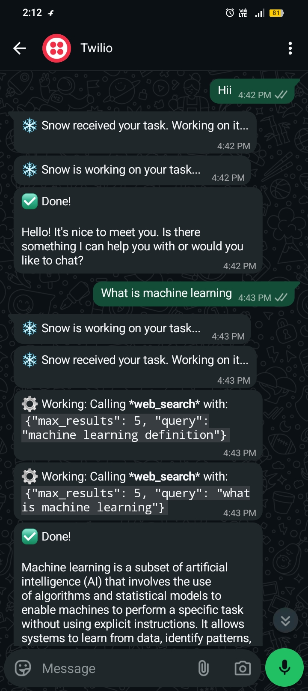

<div align="center">

<h1>❄️ Snow</h1>
<p><strong>Autonomous AI Agent — Powered by Groq + LLaMA 3.1 70B</strong></p>

[](https://python.org)
[](https://groq.com)
[](https://gradio.app)
[](LICENSE)
[](https://huggingface.co/spaces/deepika-singh/snow)

<p>Give Snow any task — it searches the web, executes code, reads and writes files, and delivers results <strong>autonomously</strong>. Works on both web and WhatsApp.</p>

### 🔗 [Live Demo → huggingface.co/spaces/deepika-singh/snow](https://huggingface.co/spaces/deepika-singh/snow)

</div>

---

## 📸 Screenshots

<div align="center">

### Web UI
.png)

### WhatsApp Bot


</div>

---

## ✨ What Snow Can Do

| Tool | Description |
|---|---|
| 🔍 **Web Search** | Real-time DuckDuckGo search for current information |
| 🌐 **Web Scrape** | Read full content of any webpage |
| 🐍 **Run Python** | Write and execute Python code autonomously |
| ⚡ **Shell Commands** | Run system commands with safety filters |
| 📁 **File I/O** | Create, read, write, and list files |
| 💬 **WhatsApp Bot** | Send Snow tasks directly from WhatsApp via Twilio |

---

## 🧠 How It Works

```
Your Task (Web UI or WhatsApp)
         ↓
Security Check (prompt injection, length validation)
         ↓
Agent Loop — LLaMA 3.1 70B reasons + picks tools
         ↓
 web_search → scrape_webpage → run_python → write_file
         ↓
Final Answer delivered with full context
```

---

## 🗂️ Project Structure

```
Snow/
├── app.py             — Gradio web UI (dark terminal aesthetic)
├── agent.py           — Core ReAct agent loop + security validation
├── tools.py           — Web search, scraping, Python execution, file I/O
├── whatsapp_bot.py    — WhatsApp bot via Twilio + Flask + ngrok
├── requirements.txt   — Python dependencies
└── .env.example       — Environment variables template
```

---

## 🚀 Quick Start

### 1. Clone & install
```bash
git clone https://github.com/Deepika-print/Snow.git
cd Snow
python -m venv .venv
.venv\Scripts\activate        # Windows
source .venv/bin/activate     # Mac/Linux
pip install -r requirements.txt
```

### 2. Create `.env` file
```env
GROQ_API_KEY=your_groq_api_key
TWILIO_ACCOUNT_SID=your_twilio_sid
TWILIO_AUTH_TOKEN=your_twilio_token
TWILIO_WHATSAPP_NUMBER=+14155238886
```

Get your **free** Groq API key at [console.groq.com](https://console.groq.com)

### 3. Run web UI
```bash
python app.py
```
Opens at **http://127.0.0.1:7860**

### 4. Run WhatsApp Bot (optional)
```bash
# Terminal 1
python whatsapp_bot.py

# Terminal 2
ngrok http 5000
```
Set Twilio webhook to: `https://your-ngrok-url/whatsapp`

---

## 🛡️ Security Features

- **Prompt injection detection** — blocks jailbreak attempts
- **Input validation** — max 2000 characters
- **Shell command filtering** — blocks `rm -rf`, `format`, `shutdown`
- **Python sandbox** — 30 second timeout, blocks dangerous imports
- **Automatic fallback** — answers directly if tool calling fails

---

## 💡 Example Tasks

```
Search for the latest AI news today and summarize the top 5 stories
Write a Python script to calculate prime numbers up to 100 and run it
Who is the current Prime Minister of India?
What is machine learning? Search and explain in detail
Search for top 5 free AI tools in 2026 and save a report to report.txt
```

---

## 📦 Tech Stack

| Component | Technology |
|---|---|
| LLM | Groq API — LLaMA 3.1 70B Versatile |
| Web Search | DuckDuckGo (ddgs) — completely free |
| Web Scraping | BeautifulSoup4 + requests |
| Web UI | Gradio — deployed on Hugging Face Spaces |
| WhatsApp | Twilio + Flask + ngrok |

---

## 🌐 Deploy on Hugging Face Spaces (Free)

1. Create new Space at [huggingface.co/spaces](https://huggingface.co/spaces) — SDK: **Gradio**
2. Upload `app.py`, `agent.py`, `tools.py`, `requirements.txt`
3. Settings → Secrets → add `GROQ_API_KEY`
4. Live at `huggingface.co/spaces/YOUR_USERNAME/snow`

---

## 📄 License

MIT — Built with ❄️ by [Deepika Singh](https://github.com/Deepika-print)

---

<div align="center">
<sub>If you found this useful, give it a ⭐ on GitHub!</sub>
</div>
